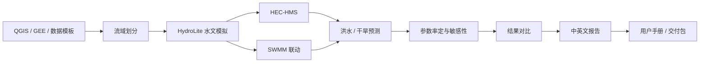

# HydroLite Studio v0.7.x Full Modeling Workflow

## 目标

v0.7.x 的目标是建立一个可扩展的全流程编排框架，把现有项目工作流、QGIS Bridge、GEE 数据中心、HydroLite 模拟、SWMM 联动、对比和报告导出串成统一入口。

当前阶段是 `0.7.0-dev` 架构阶段，不代表 HEC-HMS、洪水预测、干旱预测和自动率定已经完整实现。

## 流程图



## 阶段门禁

- `available`：已有可用 CLI 或 Streamlit 工作流。
- `partial`：已有接口或 MVP，但依赖外部环境或尚未覆盖完整业务链路。
- `planned`：规划阶段，不应宣传为已实现功能。
- `not_implemented`：暂未实现。

## 当前可用阶段

- 数据模板与规范校验。
- QGIS/GeoJSON 文件级 Bridge MVP。
- GEE 诊断、摘要和 HydroLite 输入产品。
- HydroLite SCS-CN、单位线、Muskingum 模拟。
- SWMM coupling 和结果读取的优雅降级。
- 情景对比。
- 项目报告导出。

## 当前 partial 阶段

- 流域划分 MVP：探测 qgis_process 水文算法，运行小型合成 DEM 填洼与 D8 流向，并用 HydroLite 拓扑算法完成汇流累积和河网提取；出口点分区仍为 fallback。它需要专业 GIS 人工复核，详见 `docs/watershed_delineation_mvp.md`。
- HEC-HMS 项目生成 MVP：旧骨架保持不变；新增基于官方 4.13 文件结构的校准项目，并通过真实 `Project.open`、识别 Run。
- HEC-HMS 降雨计算 MVP：HydroLite rainfall CSV 已通过内置 HEC-DSS 类写入/回读，生成项目已通过 `Project.open`、rainfall gate 和 `computeRun`；结果只做 pathname catalog，不深读。

## 规划阶段

- 专业级 DEM 流域划分和真实出口点处理。
- 已验证可运行的 HEC-HMS 项目语法、稳定真实计算和 DSS 时间序列读取。
- 洪水预测。
- 干旱预测。
- 参数率定与敏感性分析。
- 中英文用户手册统一导出。

## CLI

```bash
python -m hydrolite workflow list
python -m hydrolite workflow plan templates/workflows/full_modeling_workflow.yaml output/workflow_plan
python -m hydrolite workflow run-full projects/demo_project --dry-run
python -m hydrolite watershed mvp
python -m hydrolite hms create-project projects/qgis_workflow_project output/hec_hms_project
python -m hydrolite hms run output/hec_hms_project --dry-run
```

`dry-run` 是默认行为，用于查看计划，不触发重计算或长任务。
